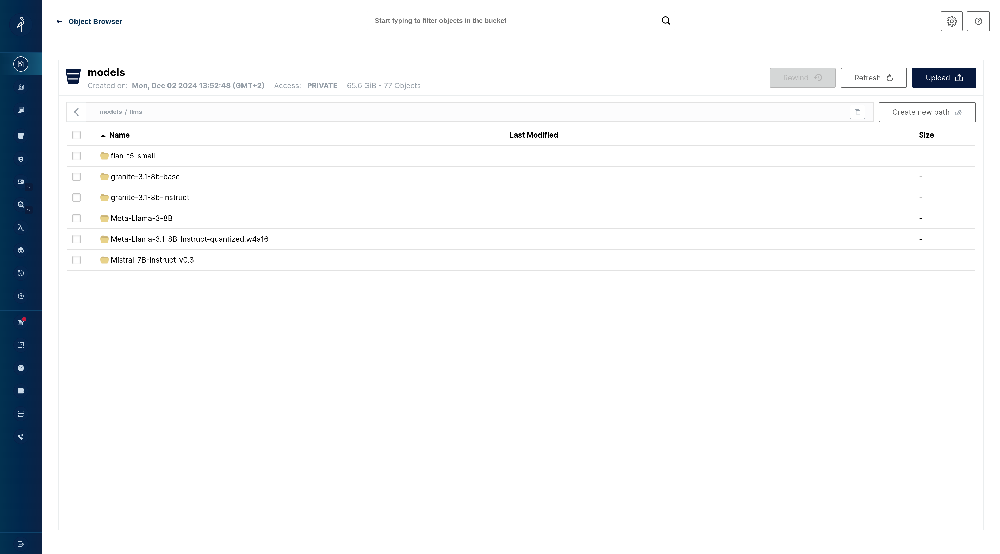
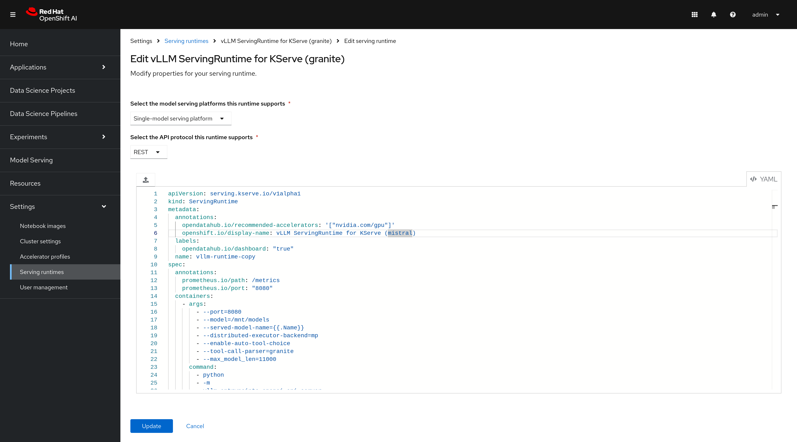
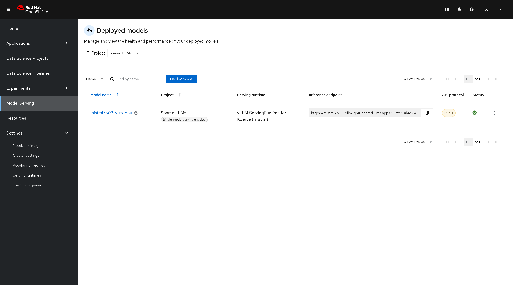
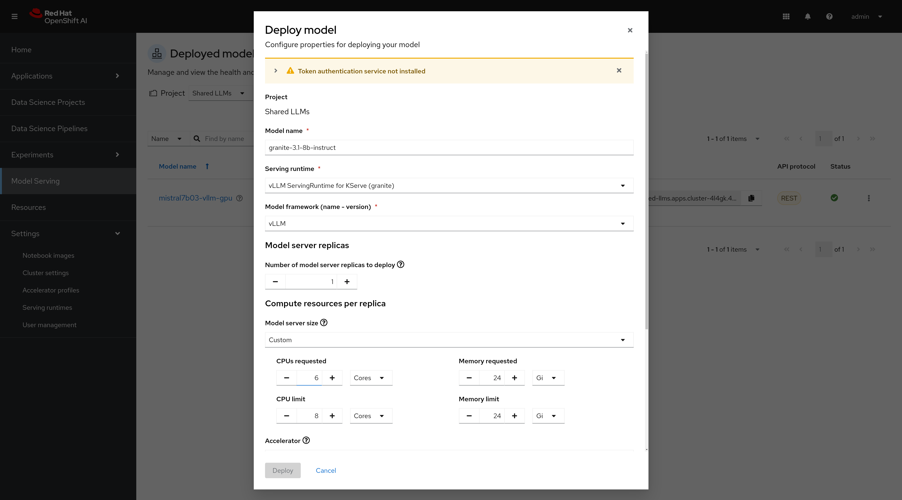
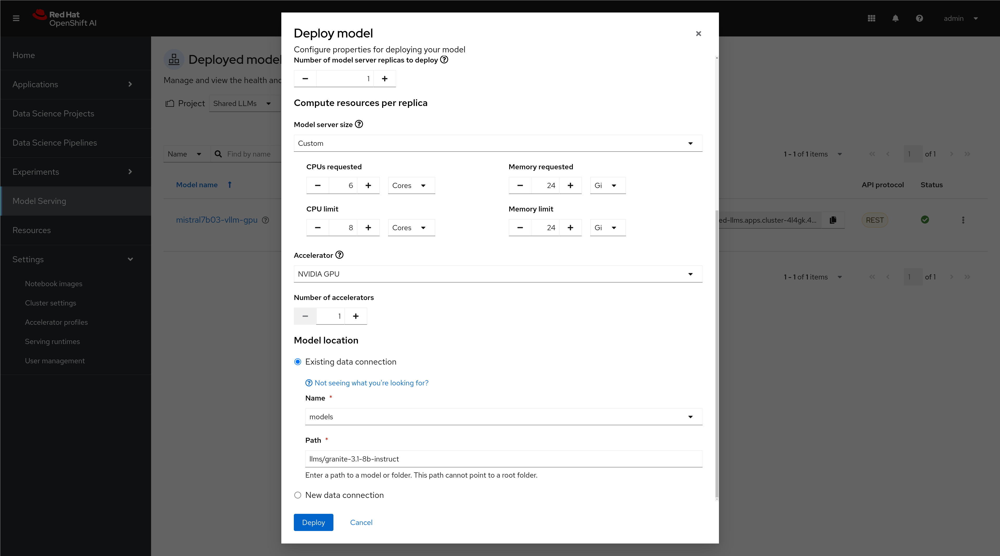
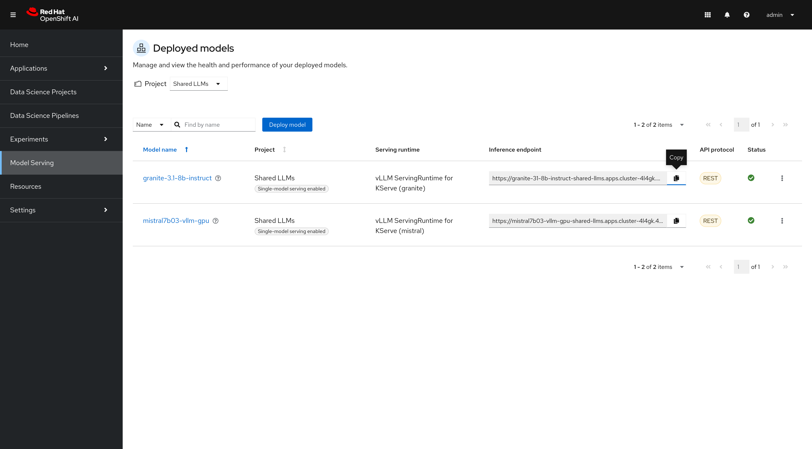

# Getting started with setting up the models on OpenShift AI.

## Requirements
- Admin access to an [OpenShift AI ready cluster](https://docs.redhat.com/en/documentation/red_hat_openshift_ai_cloud_service/1/html/installing_the_openshift_ai_cloud_service/requirements-for-openshift-ai_install#requirements-for-openshift-ai_install)
- [OpenShift CLI](https://docs.openshift.com/container-platform/4.17/cli_reference/openshift_cli/getting-started-cli.html)

##  Installing the OpenShift AI Operator

The OpenShift AI operator is going to be used in order to setup `Model Serving Runtimes` and deploy the `Models` needed for this workshop.
Instructions for installing the OpenShift AI Operator can be found [here](https://developers.redhat.com/articles/2024/05/01/red-hat-openshift-ai-installation-and-setup)

## Intalling the MinIO Operator

The MinIO Operator is going to be used in order to store the `Models` needed for this workshop.

Instructions for installing the MinIO Operator can be found [here](https://min.io/docs/minio/kubernetes/openshift/operations/installation.html)

## Uploading the Models to MinIO

Create a `MinIO` bucket say `models` and upload the `Models` needed for this workshop.

In the `models` bucket let's create a folder called `llms` to store the models.

The models used in the workshop can be downloaded from:

- https://huggingface.co/ibm-granite/granite-7b-instruct
- https://huggingface.co/mistralai/Mistral-7B-Instruct-v0.3

After uploading the models the folder should look like this:




## Creating a Data Connection

In order to use the `Models` on OpenShift AI we need to create a `Data Connection`.

Open the `OpenShift AI Console` and click on the `Data Connections` tab.
Select the MinIO Object Storage and add a new MinIO data connection if one does not already exist.

## Create a Serving Runtime

Go the `OpenShift AI Console` and click on the `Settings` tab, then select `Serving Runtimes`.
Find `vLLM ServingRuntime for KServe` or similar runtime for `vllm` and click on the `...` on the left of that row.
Select `Duplicate from that menu`.

Customize the display name as shown below:


### Granite

```yaml
apiVersion: serving.kserve.io/v1alpha1
kind: ServingRuntime
metadata:
  annotations:
    opendatahub.io/recommended-accelerators: '["nvidia.com/gpu"]'
    openshift.io/display-name: vLLM ServingRuntime for KServe (granite)
  labels:
    opendatahub.io/dashboard: "true"
  name: vllm-granite
spec:
  annotations:
    prometheus.io/path: /metrics
    prometheus.io/port: "8080"
  containers:
    - args:
        - --port=8080
        - --model=/mnt/models
        - --served-model-name=\{\{.Name\}\}
        - --distributed-executor-backend=mp
        - --enable-auto-tool-choice
        - --tool-call-parser=granite
        - --max_model_len=11000
      command:
        - python
        - -m
        - vllm.entrypoints.openai.api_server
      env:
        - name: HF_HOME
          value: /tmp/hf_home
      image: quay.io/modh/vllm:rhoai-2.17-cuda
      name: kserve-container
      ports:
        - containerPort: 8080
          protocol: TCP
  multiModel: false
  supportedModelFormats:
    - autoSelect: true
      name: vLLM
```

### Mistral

```yaml
apiVersion: serving.kserve.io/v1alpha1
kind: ServingRuntime
metadata:
  annotations:
    opendatahub.io/recommended-accelerators: '["nvidia.com/gpu"]'
    openshift.io/display-name: vLLM ServingRuntime for KServe (mistral)
  labels:
    opendatahub.io/dashboard: "true"
  name: vllm-mistral
spec:
  annotations:
    prometheus.io/path: /metrics
    prometheus.io/port: "8080"
  containers:
    - args:
        - --port=8080
        - --model=/mnt/models
        - --served-model-name=\{\{.Name\}\}
        - --distributed-executor-backend=mp
        - --max-model-len=17856
        - --enable-auto-tool-choice
        - --tool-call-parser=mistral
        - --chat-template=examples/tool_chat_template_mistral_parallel.jinja
      command:
        - python
        - -m
        - vllm.entrypoints.openai.api_server
      env:
        - name: HF_HOME
          value: /tmp/hf_home
      image: quay.io/modh/vllm@sha256:3c56d4c2a5a9565e8b07ba17a6624290c4fb39ac9097b99b946326c09a8b40c8
      name: kserve-container
      ports:
        - containerPort: 8080
          protocol: TCP
  multiModel: false
  supportedModelFormats:
    - autoSelect: true
      name: vLLM
```

### Troubleshooting

Different version of the vllm images may contain different configuration files, chat templates etc. If they are not found they can be mounted externally similarly to the model.

## Create a model serving

Open the `OpenShift AI Console` and click on the `Model Serving` tab.
Select the target project and click on the `Deploy` Button.



Fill the model configuration parameters and click on `Deploy`.







After this step the model deployment should start and should be soon ready to use within the cluster.

## Exposing the model to the outside world

If the model needs to be accessed from outside the cluster further modifications are required.
The model is deployed as a Knative `InferenceService` that is configured by default for cluster visibility.

Edit there resource:

```sh
oc edit inferenceservices.serving.kserve.io -n shared-llms granite-31-8b-instruct
```

And then delete the following label: `networking.knative.dev/visibility: cluster-local`.
The service is now exposed to the outside world. The endpoint URL can be found in the `Model Serving` tab of 
the OpenShift AI console.


